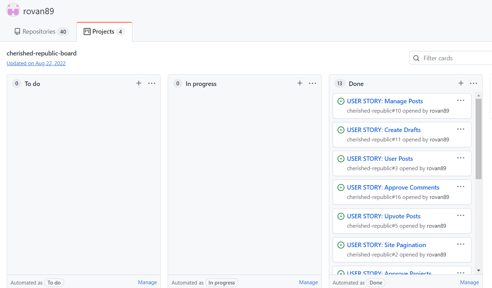

# Cherished Repblic
(Developer: Devan Hayes)
[Cherished Republic](https://cherished-republic.herokuapp.com/)

## Tables of Contents
1. [Project Goals](#project-goals)
    1. [User Experience](#user-experience)
    2. [Target Audience](#target-audience)
    3. [User Stories](#user-stories)
    4. [Business Owner Stories](#business-owner-stories)
2. [Design Choices](#design_choices)
    1. [Wireframes](#wireframes)
3. [Features](#features)
    1. [Home Page Post Display](#home_page_post_display)
    2. [Start Discussion](#start_discussion)
    3. [Join Discussion](#join_discussion)
    4. [Post Detail View](#post_detail_view)
    5. [Registration](#registration)
    6. [Login](#login)
    7. [Update Profile](#updateprofile)
    8. [Detele Account](#deteleaccount)
4. [Models](#models)
5. [Languages](#languages)
6. [Frameworks and Tools](#frameworks-and-tools)
7. [Bugs](#bugs)
8. [Testing](#testing)
9. [Deployment](#deployment)
10. [To Clone the Repository](#to_clone_the_repository)
11. [Credits](#credits)

## Project Goals
- To create a community driven site where people can come together and help thier local community become a better place.
- To allow users to interact and create discussions about thier local area.

### User Experience
The user first decides which option they would like to do, then a google sheet is updated with the data. 

### Target Audience
- The target audience for this site are poeple who want to better thier community.
- People who have ideas on how to improve their local area and need somewhere to share their thoughts.

### User Stories
1. As a User I can view a paginated list of posts so that I can easily select a post to view
2. As a User I can create posts so that share my concerns about my local area
3. As a User I can leave comments on posts so that I can voice my opinion
4. As a User I can upvote posts so that so I can help raise awareness of posts I agree with
5. As a User I can view comments of others so that I can read the conversation
6. As a User I can click on a post so that I can view the full post in detail
7. As a User I can register an account so that I can comment and like posts
8. As a User I can create a community project so that other users can join and help solve the given issue
9. As a User I can edit, update and delete posts so that I can manage my postings.
10. As a Creator of a project I can create tasks in the project so that other users can assign themselves to a task

### Business Owner Stories
1. As a Site Admin I can create, read, update and delete posts so that I can manage my page content
2. As a Site Admin I can approve posts so that the community is safe from spam and unwanted posts

## Design Choices
### Wireframes

Home Page

 

Desktop View

 

Tablet View

 

Moblie View

Post Detail Page

 

Desktop View

 

Tablet View

 

Moblie View

Create Post Page

 

Desktop View

 

Tablet View

 

Moblie View

 

## Features
### Home Page Post Display
- The home page displays all user posts.  
- These posts are ordered by date of creation.
- Post on the main page display the author, when the post was created and the heading of the post.
- Post on the main page are clickable and can open up the Post Detail page.
 
### Start Discussion
- The Start Discussion feature allows users to create discussion posts.
- This is where user can post and raise awarnes of issues in their area.

### Join Discussion
- A user can join a discussion by leaving a comment below the original dicussion post

### Post Detail View
- When the post is clicked on the main page it opens the post detail view.
- Post Detail user functions
    - Users can comment on posts
    - Users can like posts
    - Users can edit post
    - Users can delete posts

### Registration
- User can use the register link in the nave bar to be directed to the register form.
- To register the user must fill out the following feilds:
    - Username
    - E-mail
    - Password

### Login
- This feature allows users to login into their unique account.

### Update Profile
- This feature allows a user to edit or add extra content to their profile.

### Detele Account
- This feature allows the user to delete thier account.
- This will also delete any posts the user may have created.

## Models
 

## Languages
- Python 3
- CSS
- HTML 

## Frameworks and Tools
- gitHub
- Gitpod
- Git
- Cloudinary
- Heroku
- Django

## Libraries 
- PostgreSQL for the database
- Psycopg2 to connect to PostgreSQL
- DJ3 Cloudinary Storage
- Summernote

## Bugs
| **Feature / Function** | **Expected Result** | **Actual Result** | **Action** |
|-------------|------------|---------------------|-------------------|
| Register function in user/views.py | To register a user and redirect the user back to the home page | Page not found (404) | Fixed url path to point at home page |
| To allow users to create and post comments | For the comment to be posted | HTTP ERROR 405 | The function was indented incorrectly |
| In view.py the post function validates the comment | the comment should be validated | 'User' object has no attribute 'name' | Changed comment_form.instance.name = request.user.name to comment_form.instance.name = request.user.username|
| TodoItems get() menthod  | To return multiple items | Error raised: get() returned more than one ToDoList -- it returned 3! | Made change from get_object_or_404() to get_list_or_404()|

## Testing

| **Feature** | **Action** | **Expected Result** | **Manual Testing** | **Actual Result** |
|-------------|------------|---------------------|-------------------|--------------------|
| Start Discussion | This allows users to be redirected to the create post page where they can create their own post and start a community discussion | The user fills out the form and the contents get saved to the data base and are rendered o the home page | This was tested by clicking the Start Discussion button, filling out the create post form, the clicking the post button | Works as expected | 
| Edit Post | This allows users to edit posts on the site |  Users would click the edit button a be redirected to the edit post page | Click edit button, edit post click post button and update the database | Works as expected |
| Delete Post | This allows users to delete posts on the site |  Users would click the delete button which would delete the post | Click delete button and update the database | Works as expected |
| Like Post | The user can like any post on the website |  Click the like button once to like it and a second time to unlike it | | Works as expected |
| Comments | Users can read comments from other users and add their own comments | Add test comment and see if it has updated the database | | Works as expected |
| Fill in feature here | Fill in action to resolve issue here |  Fill in expected result here |Fill in Actual result here |
 

### HTML
- No errors returned when checking site through W3C Validator

### CSS
- No errors found when stie was run through W3C CSS Validator

## Deployment
Heroku was used for the deployment of this program.
1. In the workspace terminal command line: "pip3 freeze > requirements.txt"
2. Create account on Heroku
3. On the dashboard page, select "create new app"
4. Click create app
5. Go to the "settings" tab, find "Config Vars" completed the foloowing convig vars: CLOUDINARY_URL, DATABASE_URL, DISABLE_COLLECTSTATIC and SECRET_KEY
6. In settings find add buid packs to app
    1. python
6. Scroll up to the navigation menu and find "deploy", select GitHub as deployment method
7. In the Deployment Method section select Gitub or connect to GitHub
8. In the "Connect to GitHub, searh the desired repository
9. Enable automatic deploys and then deploy branch
10. Once deployed click on "View" to open aplication
 

## To Clone the Repository
- Navigate to the repository on GitHub
- Click the Code Dropdown menu
- Select your prefered option for cloning, HTTPS, SSH or Github CLI
- Open Git Bash
- Open a directory to store the project
- Type git clone and Paste in the url of the project
- Press Enter to clone the repository into the current directory 

## Credits
- Hero Image by Freepik: freepik.com

### Code
- To implement time into the program I used https://www.programiz.com/python-programming/datetime/current-time 
- To find additonal features working with Google Sheets I used https://www.youtube.com/watch?v=yPQ2Gk33b1U&ab_channel=PrettyPrinted 
